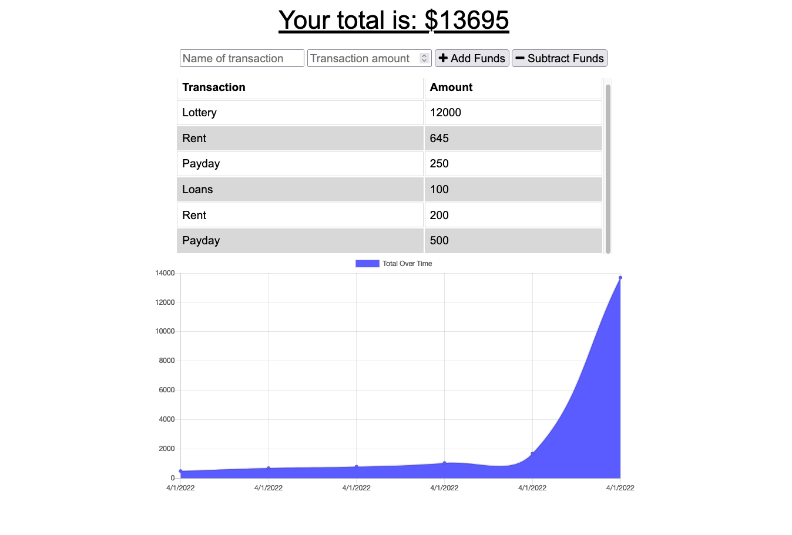

# Budget Tracker

# Description

This online note-taking tool is powered by express.js and MongoDB. Use it to record your deposits and withdrawals so you can keep track of your balance.

All data is saved to an online server so you can access your data from anywhere. For your convenience, you can even save the web app to your device. Also, if your internet connection drops, you can still record your logs in the meantime and the app will automatically upload them once you are connected again!

# Table of Contents

- [Description](#Description)
- [Preview](#preview)
- [Credits and Questions](#Credits)
- [License](#License)

# Preview

[Click here to check it out!](https://lychee-tart-84403.herokuapp.com/)

# Questions 

Contact information is provided below:
* Author: Yashar Sarabi
* Github: [Yasharjs](https://github.com/yasharjs)
* Email: yasharjs@gmail.com

# License

This project is licensed under the [The Unlicensed](https://choosealicense.com/licenses/unlicense/)

